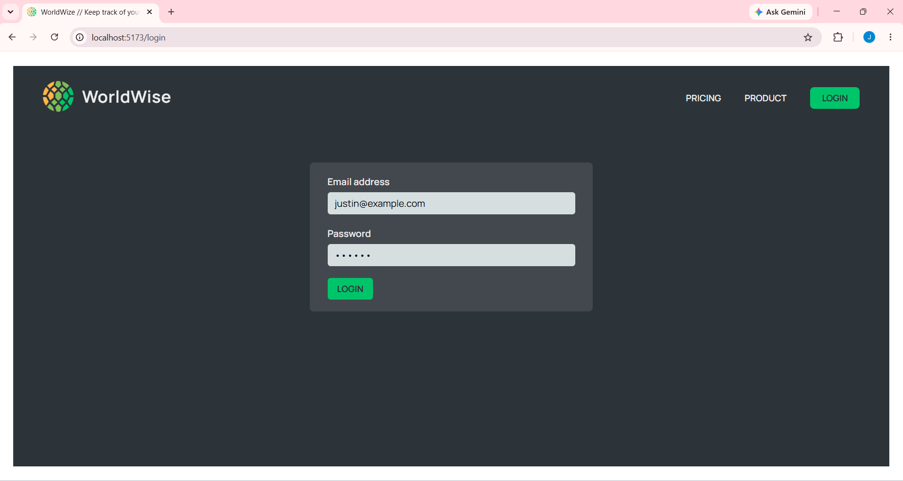

# WorldWise 🌍

WorldWise is an interactive, map-based web application designed to help users document their global travels. Users can pinpoint exact locations they have visited, log dates, and save personal notes about their experiences, creating a visual diary of their worldly adventures.

## 🚀 Features
* **Interactive Map Integration:** Click anywhere on the global map to instantly fetch location data and drop a pin.
* **Travel Logging:** Add custom notes and exact dates to any city you visit.
* **Dynamic Routing:** Seamlessly switch between a list of specific Cities and a broader list of visited Countries.
* **Geolocation:** Automatically find and center the map on your current real-world position.
* **User Authentication:** Secure login gateway for personalized travel tracking.

## 🛠️ Built With
* Vite
* React & React Router
* Leaflet / React-Leaflet (Map Integration)
* CSS Modules / Tailwind CSS
* JSON Server

## 💻 Visual Walk-through

<b>Landing Page:</b>  
The entry point introducing the app's core mission to track adventures. 

 
 
<b>User Authentication:</b>  
Secure login portal for users to access their personal map. 

 
 
<b>The Main Dashboard:</b>  
Displays the interactive map with pins of previously visited locations alongside a sortable list of cities. 

 
 
<b>Adding a New City:</b>  
By clicking on the map, a form dynamically appears allowing the user to log the date and personal notes for that specific location. 

 
 
<b>Updating the Tracker:</b>  
Once added, the city immediately populates in the sidebar list and drops a permanent pin on the map. 

 
 
<b>Reviewing Travel Notes:</b>  
Selecting a city from the list centers the map on that location and retrieves the user's saved notes and dates. 

 
 
<b>Country Overview:</b>  
The app automatically parses the city data to generate a consolidated list of all unique countries visited. 

 
 
<b>List Management:</b>  
Users can easily manage their logs by deleting cities they no longer wish to track. 

